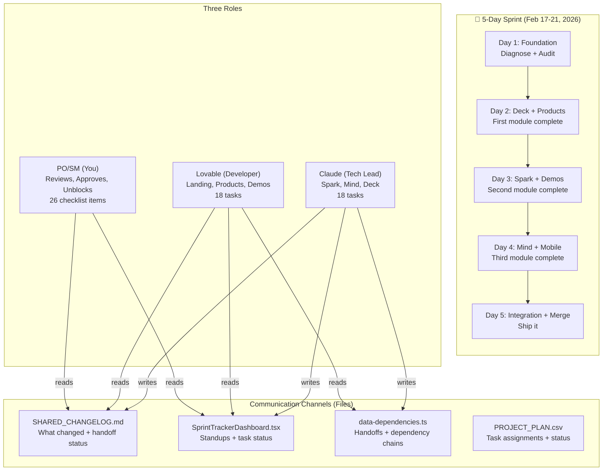
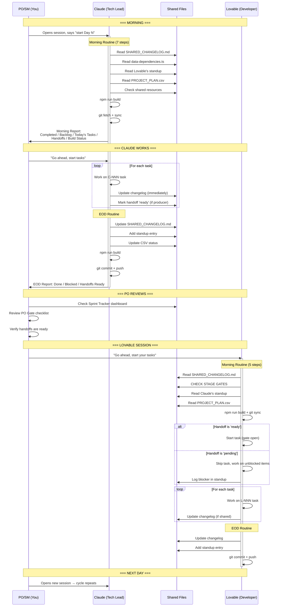
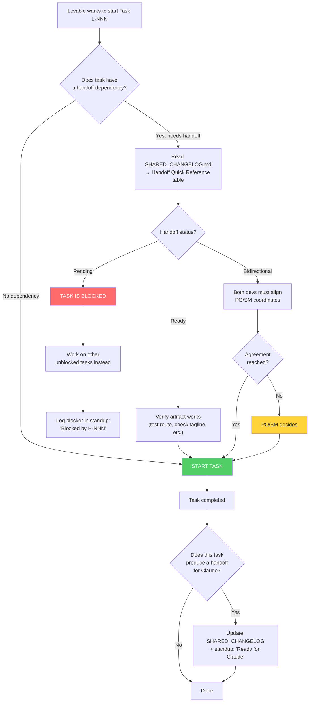
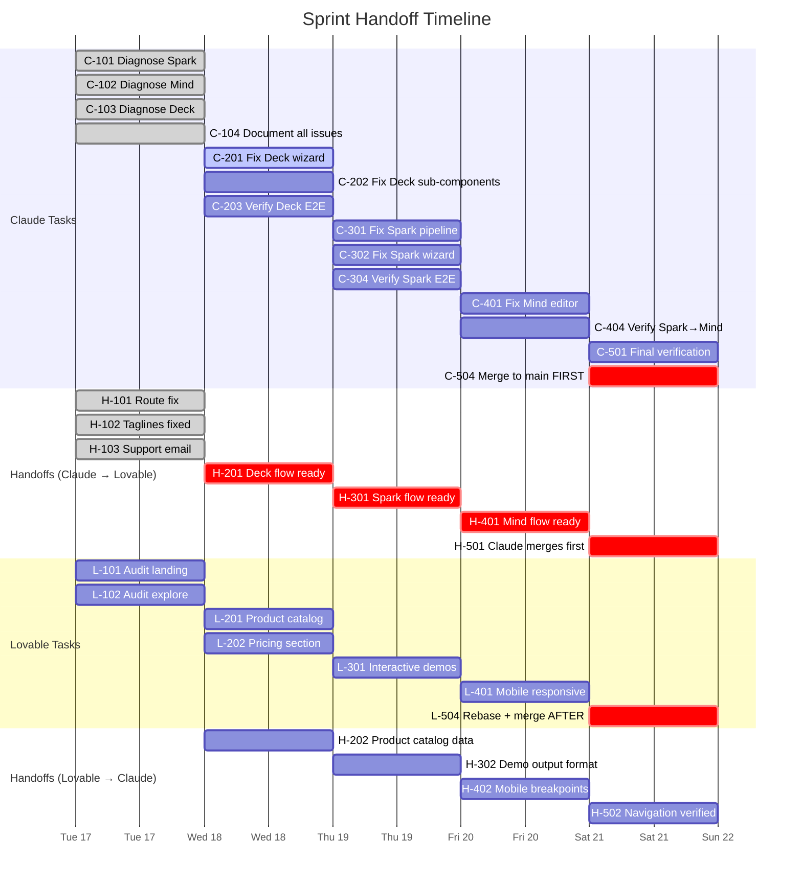
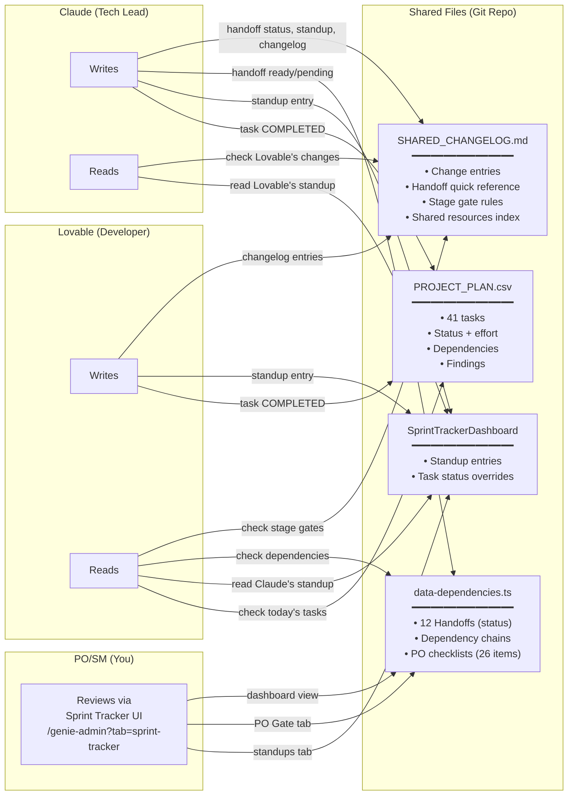
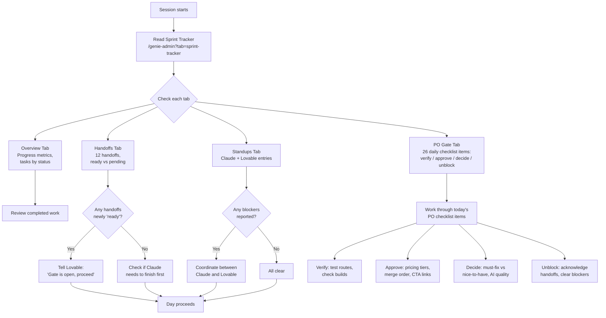
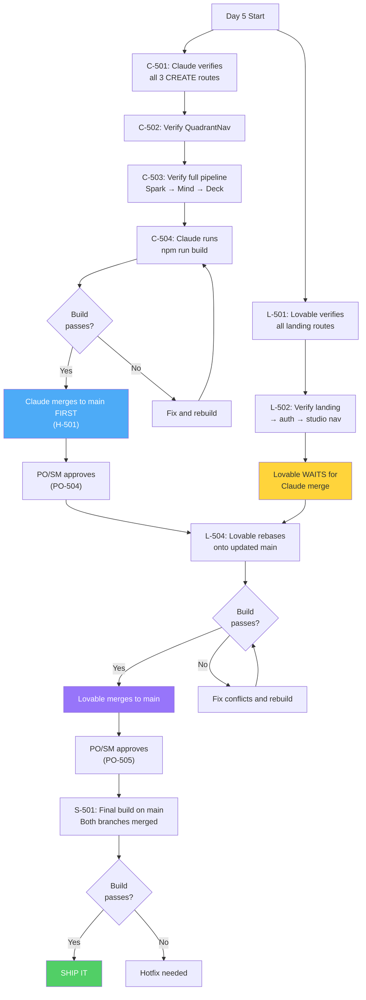

# GenieSuite Sprint Process Flow — Visual Guide

## 1. High-Level Sprint Architecture



---

## 2. Daily Cycle — How One Day Flows



---

## 3. Stage Gate Protocol — Decision Tree



---

## 4. Handoff Timeline — Day-by-Day



---

## 5. File-Based Communication Architecture



---

## 6. PO/SM Role — Your Review Workflow



---

## 7. Day 5 Merge Order — Critical Path



---

## Summary — The Simple Version

```
┌─────────────────────────────────────────────────────────┐
│                    DAILY CYCLE                          │
│                                                         │
│  ┌──────────┐    ┌──────────┐    ┌──────────┐          │
│  │  CLAUDE   │───>│  PO/SM   │───>│ LOVABLE  │          │
│  │  works    │    │ reviews  │    │  works   │          │
│  │  pushes   │    │ approves │    │  pushes  │          │
│  └──────────┘    └──────────┘    └──────────┘          │
│       │                               │                 │
│       └───────── SHARED FILES ────────┘                 │
│         changelog, standups, handoffs, csv              │
│                                                         │
│  Signal: Handoff status changes from                    │
│          'pending' → 'ready' in files                   │
│                                                         │
│  Trigger: PO/SM says "go ahead" to each developer      │
│                                                         │
│  Gate: Lovable CANNOT start blocked tasks               │
│        until handoff shows 'ready'                      │
│                                                         │
└─────────────────────────────────────────────────────────┘
```
