# Agent Architecture & Flow Documentation

## Overview

This document provides comprehensive architecture diagrams for the multi-agent, A2A, and agentic AI capabilities integrated into the platform.

## System Architecture Diagram

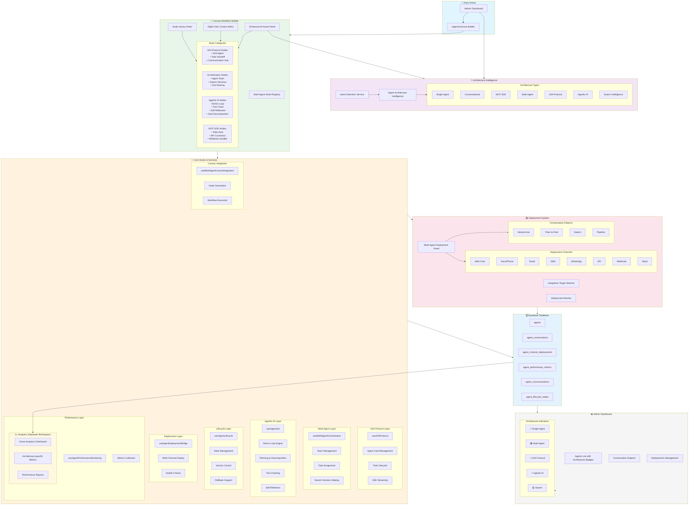

## Architecture Selection Flow

```mermaid
flowchart LR
    subgraph UserInput["User Input"]
        Description["Agent Description"]
        UseCase["Use Case Selection"]
        Features["Feature Requirements"]
    end

    subgraph Analysis["Intent Analysis"]
        Keywords["Keyword Detection"]
        Factors["Factor Analysis"]
        UseCaseMap["Use Case Mapping"]
    end

    subgraph Scoring["Architecture Scoring"]
        KeywordScore["Keyword Score (30%)"]
        UseCaseScore["Use Case Score (30%)"]
        FactorScore["Factor Score (40%)"]
    end

    subgraph Recommendation["Recommendation"]
        Primary["Primary Architecture"]
        Alternatives["3 Alternatives"]
        Reasoning["Detailed Reasoning"]
        SuggestedNodes["Suggested Nodes"]
    end

    subgraph UserDecision["User Decision"]
        Accept["Accept Primary"]
        SelectAlt["Select Alternative"]
        Override["Manual Override"]
    end

    UserInput --> Analysis
    Analysis --> Scoring
    Scoring --> Recommendation
    Recommendation --> UserDecision
```

## Agent Architecture Types

### 1. Single Agent
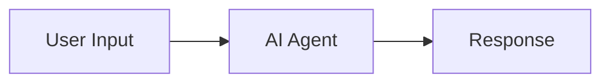
**Use Cases:** Simple FAQ, basic chatbot, information retrieval

### 2. Conversational Agent
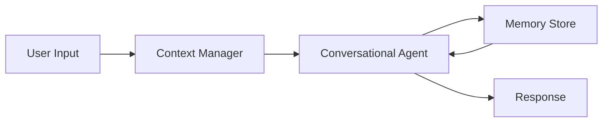
**Use Cases:** Patient intake, support conversations, guided forms

### 3. MCP SDK Integration
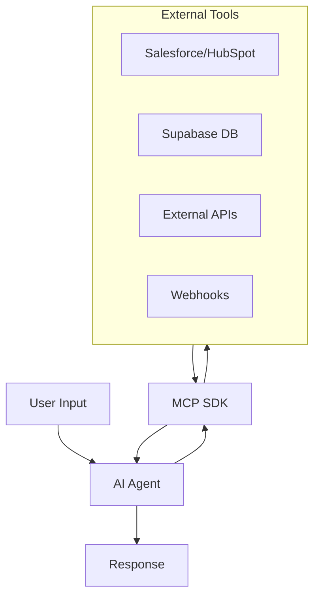
**Use Cases:** CRM sync, data integration, form processing, enrollment

### 4. Multi-Agent System
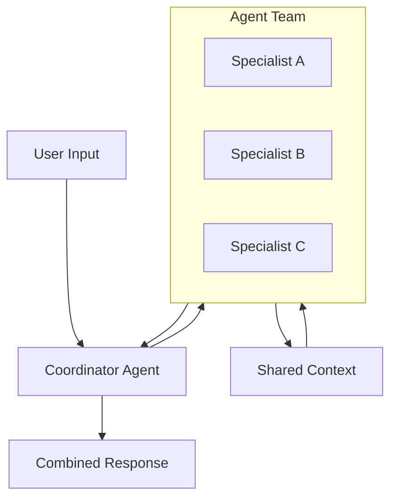
**Use Cases:** Complex workflows, parallel processing, specialized tasks

### 5. A2A Protocol
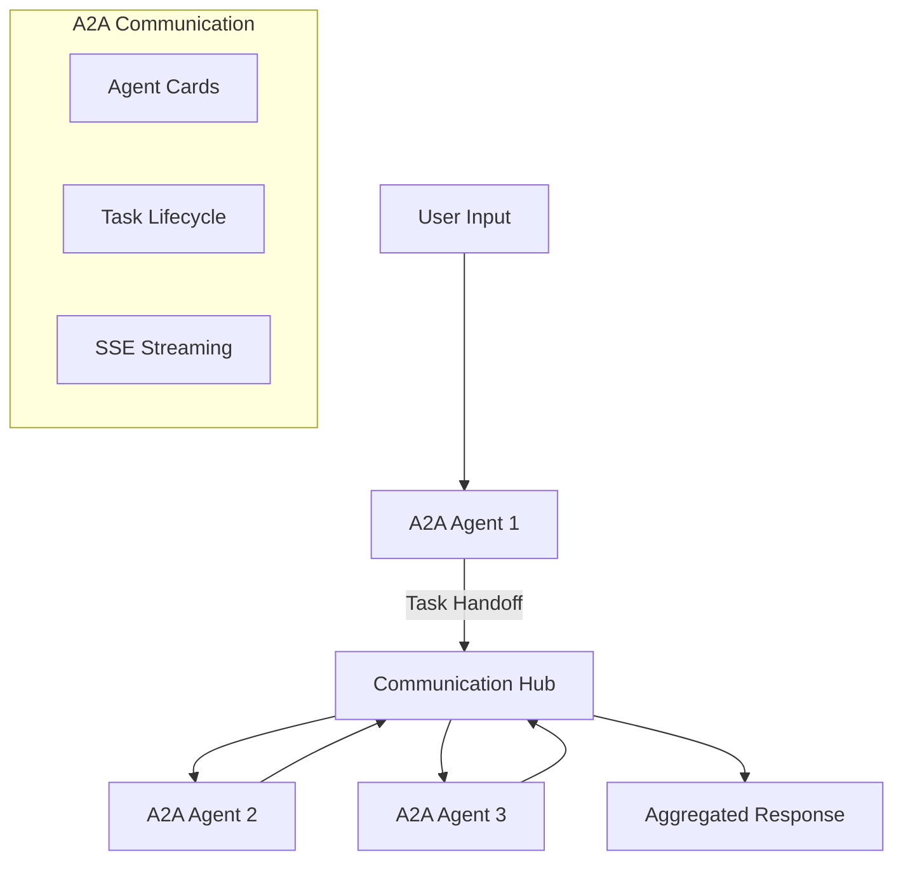
**Use Cases:** Cross-system integration, standardized agent communication, federated systems

### 6. Agentic AI (ReAct)
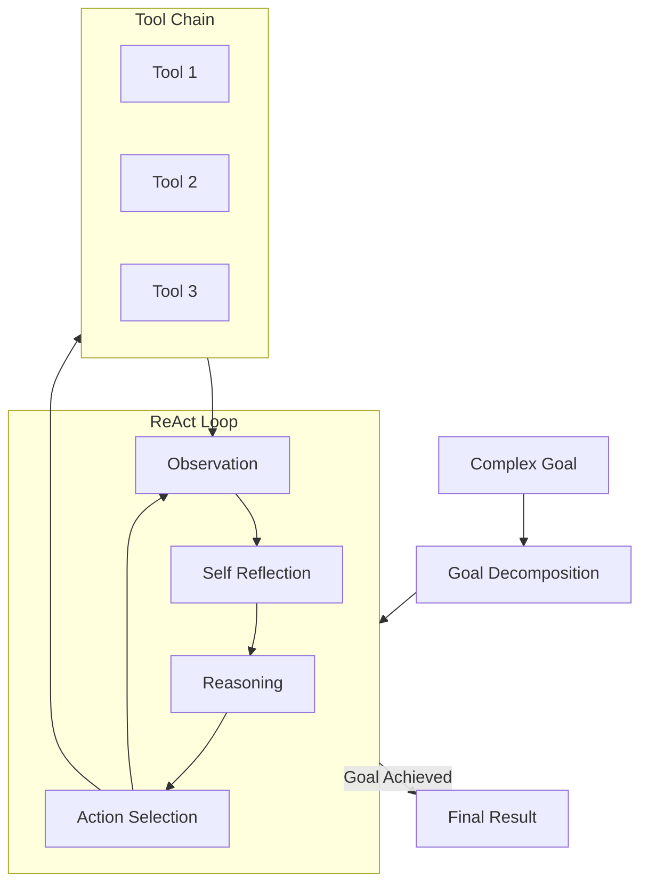
**Use Cases:** Autonomous research, complex problem solving, adaptive workflows

### 7. Swarm Intelligence
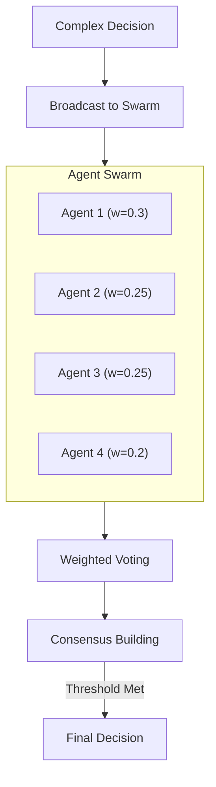
**Use Cases:** Collective decisions, multi-perspective analysis, distributed consensus

## Multi-Channel Deployment

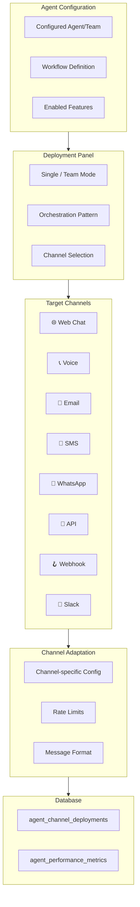

## Data Flow

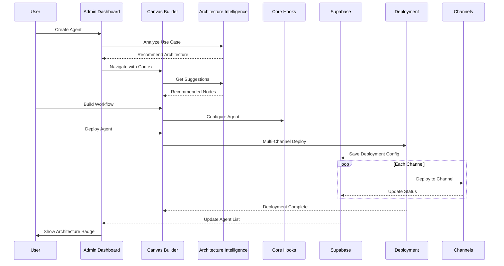

## Integration with Existing Systems

### Backward Compatibility

| Feature | Status | Integration Point |
|---------|--------|-------------------|
| Single Agent | ✅ Supported | Default architecture |
| Conversational | ✅ Supported | useConversationalContext hook |
| MCP SDK | ✅ Supported | MCP tool nodes in node library |
| Knowledge Base | ✅ Supported | KB linking in AI Assist panel |
| RAG | ✅ Supported | RAG configuration in nodes |

### New Capabilities

| Feature | Status | Integration Point |
|---------|--------|-------------------|
| A2A Protocol | ✅ New | useA2AProtocol hook, A2A nodes |
| Multi-Agent | ✅ New | useMultiAgentOrchestration hook |
| Agentic AI | ✅ New | useAgenticAI hook, ReAct nodes |
| Swarm | ✅ New | Swarm decision nodes |
| Multi-Channel | ✅ New | MultiAgentDeploymentPanel |

## File References

### Core Services
- `src/services/agentArchitectureIntelligence.ts` - Architecture recommendation engine
- `src/services/intentDetectionService.ts` - Intent analysis for responses

### Hooks
- `src/hooks/useA2AProtocol.ts` - A2A Protocol implementation
- `src/hooks/useMultiAgentOrchestration.ts` - Multi-agent coordination
- `src/hooks/useAgenticAI.ts` - Agentic AI (ReAct, planning)
- `src/hooks/useAgentLifecycle.ts` - Agent lifecycle management
- `src/hooks/useAgentDeploymentBridge.ts` - Deployment bridge
- `src/hooks/useAgentPerformanceMonitoring.ts` - Performance metrics
- `src/hooks/useMultiAgentCanvasIntegration.ts` - Canvas integration

### Components
- `src/components/workflow-builder/MultiAgentNodeTypes.tsx` - Node components
- `src/components/workflow-builder/MultiAgentNodeRegistry.ts` - Node definitions
- `src/components/workflow-builder/MultiAgentDeploymentPanel.tsx` - Deployment UI
- `src/components/workflow-builder/ArchitectureRecommendationPanel.tsx` - Recommendations UI

### Admin Dashboard
- `src/components/admin/UnifiedAgentAdminDashboard.tsx` - Agent management with badges

## Usage Examples

### 1. Getting Architecture Recommendation
```typescript
import { agentArchitectureIntelligence } from '@/services/agentArchitectureIntelligence';

const analysis = agentArchitectureIntelligence.analyzeAndRecommend(
  "I need an agent that can autonomously research and compile reports",
  "research-assistant",
  existingNodes,
  "Autonomous research agent with planning capabilities"
);

console.log(analysis.primaryRecommendation);
// { architecture: 'agentic', confidence: 0.85, reasoning: [...] }
```

### 2. Multi-Channel Deployment
```typescript
import { useMultiAgentCanvasIntegration } from '@/hooks/useMultiAgentCanvasIntegration';

const { deployToMultipleChannels } = useMultiAgentCanvasIntegration();

await deployToMultipleChannels(
  agentConfig,
  ['web-chat', 'voice', 'email', 'slack']
);
```

### 3. Creating A2A Agent Node
```typescript
const { createA2AAgentNode } = useMultiAgentCanvasIntegration();

const node = createA2AAgentNode(agentId, 'task-processor');
// Returns canvas-compatible node with A2A capabilities
```
