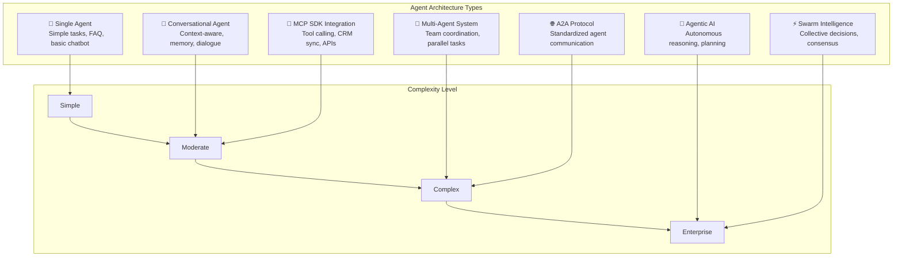
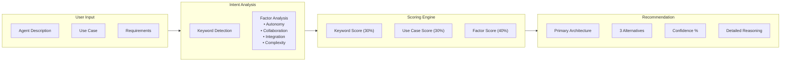
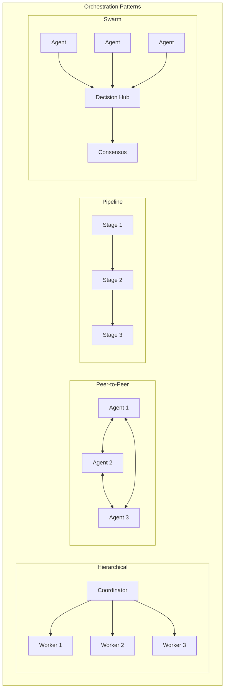
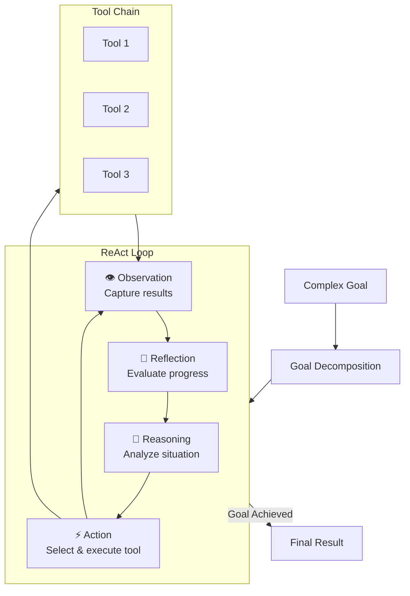
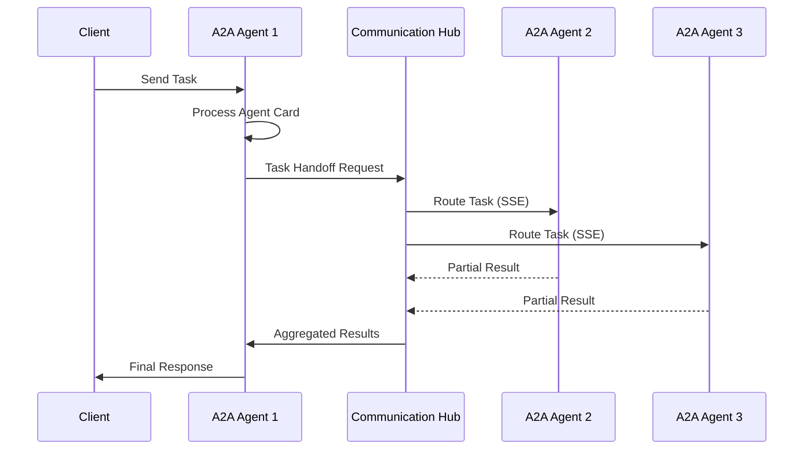
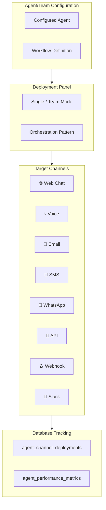
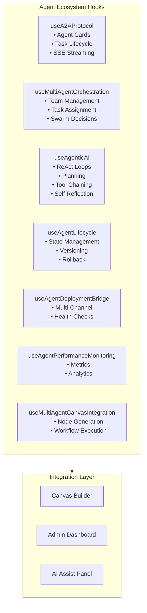

# 🏗️ Complete Architecture Documentation

## 📋 Project Overview

This document provides comprehensive architecture documentation for the healthcare testing framework. The system implements a multi-tenant, role-based application with enterprise-grade security, scalability, and compliance features.

## 🎯 System Architecture Types

### 1. High-Level Architecture
**Purpose**: System overview and major component interactions  
**Scope**: Enterprise-level system architecture  
**Components**: Frontend, API Gateway, Database, External Systems  
**Available Formats**: PDF, PNG, Word

### 2. Low-Level Architecture  
**Purpose**: Detailed technical implementation and component design  
**Scope**: Deep technical dive into system internals  
**Components**: Database Schema, API Endpoints, Service Classes, Utility Functions  
**Available Formats**: PDF, PNG, Word

### 3. Security Architecture
**Purpose**: Security implementation and compliance framework  
**Scope**: Comprehensive security architecture for healthcare data protection  
**Components**: Authentication, Authorization, Data Encryption, Audit Trail  
**Available Formats**: PDF, PNG, Word

### 4. Reference Architecture
**Purpose**: Standard patterns and best practices implementation  
**Scope**: Reference implementations and architectural patterns  
**Components**: Design Patterns, Security Frameworks, Integration Patterns  
**Available Formats**: PDF, PNG, PowerPoint

### 5. Flow & Process Architecture
**Purpose**: Detailed workflow and process flow documentation  
**Scope**: Comprehensive process flows for all major system operations  
**Components**: User Journeys, Test Execution, Data Processing, Compliance  
**Available Formats**: PDF, PNG, Visio

### 6. Deployment Architecture
**Purpose**: Infrastructure and deployment configuration  
**Scope**: Cloud-native deployment with scalability and reliability  
**Components**: Container Strategy, Load Balancing, Monitoring Stack  
**Available Formats**: PDF, PNG, YAML

## 🏗️ Technical Stack

### Frontend Technologies
- **Framework**: React 18 with TypeScript
- **Styling**: Tailwind CSS with Design System
- **Components**: Shadcn/ui component library
- **State Management**: React Query + Context API
- **Routing**: React Router v6
- **Build Tool**: Vite

### Backend Technologies
- **Platform**: Supabase (PostgreSQL + Edge Functions)
- **Database**: PostgreSQL with Row Level Security
- **Authentication**: Supabase Auth
- **API**: RESTful APIs with Edge Functions
- **Real-time**: Supabase Realtime subscriptions

### Security & Compliance
- **Authentication**: Multi-factor authentication support
- **Authorization**: Role-Based Access Control (RBAC)
- **Data Protection**: Encryption at rest and in transit
- **Compliance**: HIPAA-ready with audit trails
- **Multi-tenancy**: Complete tenant data isolation

## 🔄 System Flows

### User Authentication Flow
1. User attempts login
2. Supabase Auth validates credentials
3. System checks user roles and permissions
4. User is redirected to appropriate module
5. Session is established with proper scope

### Test Execution Flow
1. User creates or selects test case
2. System validates test parameters
3. Test execution engine runs test
4. Results are captured and stored
5. Compliance validation is performed
6. Reports are generated automatically

### Data Processing Flow
1. Data input validation
2. Business rule application
3. Database storage with RLS
4. Audit trail generation
5. Real-time updates to connected clients

## 🏢 Component Architecture

### UI Component Hierarchy
```
App
├── Layout Components
│   ├── Navigation
│   ├── Sidebar
│   └── Header
├── Page Components
│   ├── Dashboard
│   ├── Testing
│   ├── Users
│   └── Reports
├── Business Components
│   ├── TestCasesDisplay
│   ├── ExecutionHistory
│   ├── ComplianceReports
│   └── UserManagement
└── Base Components (Shadcn/ui)
    ├── Button
    ├── Card
    ├── Dialog
    └── Form Components
```

### Hook Architecture
```
Custom Hooks
├── Business Logic Hooks
│   ├── useEnhancedTesting
│   ├── useComplianceReporting
│   └── useUserManagement
├── Data Hooks
│   ├── useSupabaseQuery
│   ├── useSupabaseMutation
│   └── useRealTimeSubscription
└── Utility Hooks
    ├── useRoleBasedNavigation
    ├── usePermissions
    └── useTheme
```

## 🗄️ Database Schema

### Core Tables
- **profiles**: User profile information
- **roles**: System roles definition
- **permissions**: Permission definitions
- **user_roles**: User-role assignments
- **user_permissions**: User-specific permissions

### Testing Framework Tables
- **comprehensive_test_cases**: Test case definitions
- **test_execution_history**: Test run results
- **compliance_reports**: Compliance validation results
- **system_functionality_registry**: System functionality tracking

### Audit & Security Tables
- **audit_logs**: System activity audit trail
- **security_events**: Security-related events
- **user_activity_logs**: User activity tracking

## 🔒 Security Implementation

### Authentication Layer
- **Provider**: Supabase Auth
- **Methods**: Email/password, OAuth providers
- **Features**: Email verification, password reset
- **Session Management**: JWT tokens with refresh

### Authorization Framework
- **Model**: Role-Based Access Control (RBAC)
- **Granularity**: Module-level and feature-level permissions
- **Implementation**: React context + custom hooks
- **Database**: Row Level Security (RLS) policies

### Data Protection
- **Encryption**: TLS 1.3 in transit, AES-256 at rest
- **Isolation**: Multi-tenant data separation
- **Audit**: Comprehensive activity logging
- **Compliance**: HIPAA-ready implementation

## 🚀 Deployment Architecture

### Development Environment
- **Local Development**: Vite dev server + Supabase local
- **Staging**: Vercel preview deployments
- **Testing**: Automated test suite with CI/CD

### Production Environment
- **Frontend**: CDN-distributed static assets
- **Backend**: Supabase Cloud (AWS/global)
- **Database**: PostgreSQL with automatic backups
- **Monitoring**: Built-in Supabase monitoring + custom alerts

### Scaling Strategy
- **Frontend**: CDN edge caching
- **Backend**: Supabase auto-scaling
- **Database**: Connection pooling + read replicas
- **Monitoring**: Performance metrics + error tracking

## 📊 Performance Optimization

### Frontend Optimizations
- **Code Splitting**: Route-based lazy loading
- **Component Optimization**: React.memo for expensive components
- **Bundle Optimization**: Tree shaking + compression
- **Caching**: React Query for API response caching

### Backend Optimizations
- **Database**: Optimized queries + indexing strategy
- **API**: Edge function optimization
- **Caching**: Supabase built-in caching
- **Real-time**: Selective subscription management

## 🧪 Testing Strategy

### Unit Testing
- **Framework**: Vitest
- **Coverage**: Component logic + utility functions
- **Mocking**: API responses + external dependencies

### Integration Testing
- **Scope**: Component integration + API flows
- **Database**: Test database with sample data
- **Authentication**: Mock auth for test scenarios

### End-to-End Testing
- **Framework**: Playwright
- **Scope**: Critical user journeys
- **Environment**: Staging environment testing

## 📈 Monitoring & Analytics

### Performance Monitoring
- **Metrics**: Page load times, API response times
- **Alerts**: Performance threshold violations
- **Dashboards**: Real-time performance visualization

### Error Tracking
- **Collection**: Automated error reporting
- **Analysis**: Error trend analysis
- **Alerts**: Critical error notifications

### Usage Analytics
- **User Behavior**: Feature usage patterns
- **System Health**: Database performance metrics
- **Compliance**: Audit report generation

## 🔄 Continuous Integration/Deployment

### CI Pipeline
1. Code commit triggers build
2. Automated testing (unit + integration)
3. Security scanning
4. Build optimization
5. Deployment to staging

### CD Pipeline
1. Staging validation
2. Production deployment
3. Database migrations (if needed)
4. Health checks
5. Rollback capability

## 📚 Documentation Structure

### Available Documentation Formats

#### PDF Documents
- **High-Level Architecture**: Complete system overview
- **Security Framework**: Security implementation guide
- **Deployment Guide**: Infrastructure setup instructions
- **API Reference**: Complete API documentation

#### PNG Diagrams
- **System Architecture**: Visual system overview
- **Database Schema**: ER diagrams and relationships
- **Flow Diagrams**: Process and data flow visualizations
- **Security Architecture**: Security layer diagrams

#### Word Documents
- **Implementation Guide**: Step-by-step implementation
- **Security Policies**: Security procedures and policies
- **User Manual**: End-user documentation
- **Administrator Guide**: System administration procedures

## 🤖 AI Agent Architecture (NEW)

### Agent Architecture Types

The platform supports multiple agent architectures based on use case complexity:



### Architecture Intelligence System



### Multi-Agent Orchestration Patterns



### Agentic AI (ReAct) Architecture



### A2A Protocol Communication



### Multi-Channel Deployment



### Core Hooks Architecture



## 🎯 Future Enhancements

### Planned Features
1. **Advanced Analytics**: ML-powered insights
2. **Mobile Application**: React Native companion app
3. **API Gateway**: Enhanced API management
4. **Microservices**: Service decomposition strategy
5. **Advanced A2A**: Cross-platform agent federation
6. **AutoGen Integration**: Microsoft AutoGen patterns

### Technical Improvements
1. **Performance**: Further optimization strategies
2. **Security**: Advanced threat detection
3. **Scalability**: Global deployment capabilities
4. **Integration**: Third-party system connectors
5. **Agentic Workflows**: Enhanced autonomous capabilities

---

## 📞 Support & Maintenance

### Documentation Updates
- **Frequency**: Updated with each major release
- **Versioning**: Semantic versioning for documentation
- **Distribution**: Multiple format downloads available

### Technical Support
- **Architecture Reviews**: Regular architecture assessments
- **Performance Audits**: Quarterly performance reviews
- **Security Audits**: Annual security assessments
- **Compliance Reviews**: Ongoing compliance validation

---

*This documentation is automatically generated and updated. For the latest version, please download from the Architecture Documentation module.*