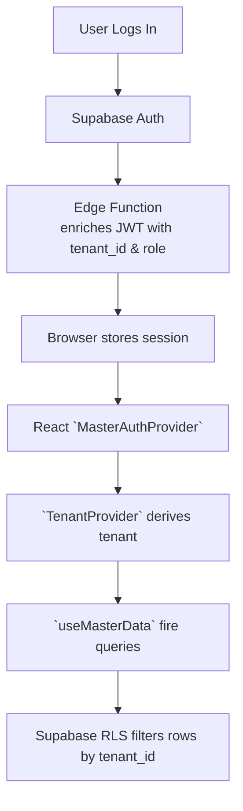

# 🏢 Multi-Tenant Architecture

**Date:** 2025-07-09  
**Version:** 2.0.0

---

## 1  Overview
This application now supports *true* multi-tenant operation. Each customer / organisation (‘tenant’) is logically isolated while still sharing the same running application and database cluster.

Key pillars:
1. **Tenant-aware authentication** – every JWT issued by Supabase now carries a `tenant_id` claim.
2. **Row-Level Security** – tables include a `tenant_id` column and RLS policies restrict every query to `tenant_id = current_setting('request.jwt.claim.tenant_id')`.
3. **Role-Based Access Control (RBAC)** – three Postgres roles (`app_anon`, `app_user`, `app_admin`) map to front-end capabilities via the `useRBAC` hook.
4. **Branch-Schema mapping** – CI deploys feature branches to *schema clones* (`public_dev`, `public_test`, `public_uat`) so data and migrations can be tested without touching production.

---

## 2  Security Model
| Layer | Responsibility | Enforcement |
|-------|----------------|-------------|
| **JWT Claim** | Sets `tenant_id`, `role` in every token | Auth hook (`onAuthStateChange`) & Edge Function during sign-in |
| **Database Role** | `app_anon`, `app_user`, `app_admin` | Supabase's built-in *auth.role* claim maps to Postgres role |
| **RLS** | `tenant_id = current_tenant_uuid()` on SELECT / DML | `20250709182000_multi_tenant_rls.sql` migration |
| **Client SDK** | Supplies JWT automatically | Supabase JS client |
| **Front-end** | `useTenant`, `useRBAC` inspect claims, hide UI | React hooks |

### 2.1  Cross-Tenant Leakage Protection
* All SELECT / INSERT / UPDATE statements are filtered by RLS.
* An optional catch-all `SECURITY DEFINER` function _current_tenant_uuid()_ returns `NULL` when claim is missing → queries crash instead of leaking data.
* `app_admin` role can bypass tenant filter via explicit policies (used by sys-admins & background jobs).

---

## 3  Table Layout Changes
```
+--------------------------+---------------+--------------+
| Table                    | tenant_id     | PK           |
+--------------------------+---------------+--------------+
| profiles                 | uuid NOT NULL | id           |
| facilities               | uuid NOT NULL | id           |
| modules                  | uuid NOT NULL | id           |
| api_integration_registry | uuid NOT NULL | id           |
+--------------------------+---------------+--------------+
```
Each table keeps its original primary key; `tenant_id` is simply appended.

---

## 4  Runtime Flow


---

## 5  Operational Considerations
1. **Back-filling existing rows** – run `UPDATE <table> SET tenant_id = '<uuid>' WHERE tenant_id IS NULL;` before enabling strict policies in production.
2. **Creating a new tenant** – insert a row in `tenants` table (planned) and assign users; JWT edge function will pick it up.
3. **Super-admin tooling** – privileged dashboards authenticate as `app_admin` to view cross-tenant analytics.

---

## 6  Next Steps
* Move email templates, storage buckets, etc., to tenant-scoped folders.
* Add tenant switcher UI for super-admins.
* Automate tenant bootstrap (schema seeding, default roles) via Supabase Functions.